<div align="center">

<!-- Animated Typing Header -->
<a href="https://git.io/typing-svg"></a>

<br/>

<!-- Animated Wave Banner -->


<br/>

<!-- Badges Row 1 - Status -->


<br/>

<!-- Badges Row 2 - Tech Stack -->


<br/>

<!-- Badges Row 3 - Tools -->


<br/><br/>

<!-- Profile Views Counter -->


</div>

---


## 🧠 About This Repository

> *A structured, day-by-day learning journey through Data Science & Machine Learning — complete with interactive teaching notebooks, literal/clear datasets, visual benchmarks, and detailed descriptions.*

This repository acts as an **interactive classroom resource** for anyone starting out in Machine Learning. Instead of complicated code abstractions, pipelines, and mathematical jargon, the resources are designed to highlight **simplicity, learning, and visual interpretation**.

### 🌟 Core Notebook Highlights
* **Literal Datasets**: Datasets are hardcoded directly in Python code lists instead of using random generators. You can see and read every single record!
* **16-Step ML Lifecycle**: Every notebook guides you systematically from introductions, Exploratory Data Analysis (EDA), cleaning, and splitting, to training, evaluations, performance plotting, and interpretation.
* **Explanation Pointers**: Theoretical concepts, models, and metric meanings are broken down using simple bulleted pointers.
* **Observations**: Every single execution step ends with a clear explanation answering: *"What Did We Observe?"* and *"What Did We Learn?"*.

---


## 🗂️ Repository Structure

```
📦 Data_Science_Notes
│
├── 📂 models/                             # Interactive Teaching Notebooks
│   ├── 📈 Linear_Regression.ipynb
│   ├── 📈 Ridge_Regression.ipynb
│   ├── 📈 Lasso_Regression.ipynb
│   ├── 🎯 Logistic_Regression.ipynb
│   ├── 🌲 Decision_Tree.ipynb
│   ├── 👥 KNN.ipynb
│   ├── ⚡ SVM.ipynb
│   ├── ✉️ Naive_Bayes.ipynb
│   ├── 🌳 Random_Forest.ipynb
│   ├── 🚀 AdaBoost.ipynb
│   ├── 🔥 XGBoost.ipynb
│   ├── 🧬 K_Means.ipynb
│   └── 📉 PCA.ipynb
│
├── 📂 datasets/                           # Accompanying CSV Datasets
│   ├── 📊 Salary_Data.csv
│   ├── 📊 Titanic-Dataset.csv
│   ├── 📊 Telco-Customer-Churn.csv
│   └── ....
│
└── 📄 README.md
```

---


## 📚 Machine Learning Notebook Suite

| Notebook | Algorithm Type | Problem Description | Key Visualizations |
| :--- | :--- | :--- | :--- |
| [Linear Regression](file:///c:/Users/GFG/Desktop/GeeksforGeeks/Data%20Science%20Notes/models/Linear_Regression.ipynb) | Supervised Regression | Predict exam scores using weekly study hours. | Actual vs. Predicted Scatter, Residual Plot |
| [Ridge Regression](file:///c:/Users/GFG/Desktop/GeeksforGeeks/Data%20Science%20Notes/models/Ridge_Regression.ipynb) | Supervised Regression | Predict scores with correlated features (L2 penalty). | Actual vs. Predicted, Residual Plot |
| [Lasso Regression](file:///c:/Users/GFG/Desktop/GeeksforGeeks/Data%20Science%20Notes/models/Lasso_Regression.ipynb) | Supervised Regression | Predict scores while filtering out Shoe Size (L1 penalty). | Actual vs. Predicted, Feature Coefficients Bar |
| [Logistic Regression](file:///c:/Users/GFG/Desktop/GeeksforGeeks/Data%20Science%20Notes/models/Logistic_Regression.ipynb) | Supervised Classification | Predict if a student will Pass or Fail. | Confusion Matrix Heatmap, Sigmoid Curve |
| [Decision Tree](file:///c:/Users/GFG/Desktop/GeeksforGeeks/Data%20Science%20Notes/models/Decision_Tree.ipynb) | Supervised Classification | Predict if visitor buys a premium product. | Flowchart Tree Structure, Feature Importance |
| [KNN](file:///c:/Users/GFG/Desktop/GeeksforGeeks/Data%20Science%20Notes/models/KNN.ipynb) | Supervised Classification | Predict athlete sport from height & weight. | 2D Decision Boundary Contour, Confusion Heatmap |
| [SVM](file:///c:/Users/GFG/Desktop/GeeksforGeeks/Data%20Science%20Notes/models/SVM.ipynb) | Supervised Classification | Classify fitness screening outcomes. | Hyperplane & Margins, Support Vector Highlights |
| [Naive Bayes](file:///c:/Users/GFG/Desktop/GeeksforGeeks/Data%20Science%20Notes/models/Naive_Bayes.ipynb) | Supervised Classification | Filter spam emails. | Probability Density Curve, Confusion Heatmap |
| [Random Forest](file:///c:/Users/GFG/Desktop/GeeksforGeeks/Data%20Science%20Notes/models/Random_Forest.ipynb) | Supervised Classification | Predict loan approvals using bagging ensembles. | Feature Importance, Single Estimator Tree |
| [AdaBoost](file:///c:/Users/GFG/Desktop/GeeksforGeeks/Data%20Science%20Notes/models/AdaBoost.ipynb) | Supervised Classification | Predict card payment defaults (boosting). | Feature Importance, Confusion Matrix Heatmap |
| [XGBoost](file:///c:/Users/GFG/Desktop/GeeksforGeeks/Data%20Science%20Notes/models/XGBoost.ipynb) | Supervised Classification | Predict borrower default limits (gradient boosting). | Feature Importance, Confusion Matrix Heatmap |
| [K-Means](file:///c:/Users/GFG/Desktop/GeeksforGeeks/Data%20Science%20Notes/models/K_Means.ipynb) | Unsupervised Clustering | Segment retail store shoppers. | Segment Scatter with Centroids, Elbow Curve |
| [PCA](file:///c:/Users/GFG/Desktop/GeeksforGeeks/Data%20Science%20Notes/models/PCA.ipynb) | Unsupervised Dimensionality | Compress student subject grades to 2 dimensions. | Scree Plot (Explained Variance), 2D PC Scatter |

---


## 🗺️ Learning Roadmap

```mermaid
graph TD
    A[📈 Regression] --> A1[Linear Regression]
    A --> A2[Ridge Regression]
    A --> A3[Lasso Regression]
    
    B[🎯 Classification] --> B1[Logistic Regression]
    B --> B2[Decision Tree]
    B --> B3[KNN]
    B --> B4[SVM]
    B --> B5[Naive Bayes]
    
    C[🌲 Ensembles] --> C1[Random Forest]
    C --> C2[AdaBoost]
    C --> C3[XGBoost]
    
    D[🧬 Unsupervised] --> D1[K-Means Clustering]
    D --> D2[PCA Dimension Reduction]

    style A fill:#0d1117,stroke:#00d9ff,color:#ffffff
    style B fill:#0d1117,stroke:#7c3aed,color:#ffffff
    style C fill:#0d1117,stroke:#34d399,color:#ffffff
    style D fill:#0d1117,stroke:#fbbf24,color:#ffffff
```



---


## 🤝 Contributing

Contributions, issues, and feature requests are welcome! Feel free to check the [issues page](https://github.com/JayanGupta/Data_Science_Notes/issues).

1. 🍴 Fork the Project
2. 🌿 Create your Feature Branch (`git checkout -b feature/AmazingFeature`)
3. 💾 Commit your Changes (`git commit -m 'Add AmazingFeature'`)
4. 📤 Push to the Branch (`git push origin feature/AmazingFeature`)
5. 🔃 Open a Pull Request

---


## ⭐ Show Your Support

Give a ⭐ if this project helped you! It motivates to keep adding more content.

<div align="center">

[](https://star-history.com/#JayanGupta/Data_Science_Notes&Date)

</div>

---

<div align="center">

<!-- Animated Footer Wave -->


<br/>

<b>Made with ❤️ by <a href="https://github.com/JayanGupta">Jayan Gupta</a></b>

<br/><br/>


</div>
