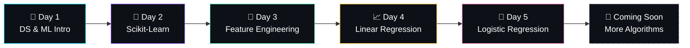

<div align="center">

<!-- Animated Typing Header -->
<a href="https://git.io/typing-svg"></a>

<br/>

<!-- Animated Wave Banner -->


<br/>

<!-- Badges Row 1 - Status -->


<br/>

<!-- Badges Row 2 - Tech Stack -->


<br/>

<!-- Badges Row 3 - Tools -->


<br/><br/>

<!-- Profile Views Counter -->


</div>

---

<!-- Animated Divider -->


## 🧠 About This Repository

> *A structured, day-by-day learning journey through Data Science & Machine Learning — complete with detailed notes, real-world datasets, SQL exercises, and Python implementations.*

This repository serves as a **one-stop knowledge base** for anyone diving into Data Science. Whether you're a beginner exploring the fundamentals or someone brushing up on ML algorithms, these notes cover the essential building blocks with hands-on code and curated datasets.


## 🗂️ Repository Structure

```
📦 Data_Science_Notes
│
├── 📂 notes/
│   ├── 📁 Day 1 — Introduction to DS and ML
│   ├── 📁 Day 2 — Introduction to Scikit-Learn
│   ├── 📁 Day 3 — Data Preparation & Feature Engineering
│   ├── 📁 Day 4 — Linear Regression (Notes + Notebook)
│   ├── 📁 Day 5 — Logistic Regression
│   └── 📁 temp/ — Supplementary scripts & materials
│
├── 📂 datasets/
│   ├── 📊 Salary_Data.csv
│   ├── 📊 Titanic-Dataset.csv
│   ├── 📊 Telco-Customer-Churn.csv
│   ├── 📊 Travel.csv
│   ├── 📊 airbnb.csv
│   ├── 📊 car details v4.csv
│   ├── 📊 creditcard.zip
│   ├── 📊 cricbuzz.csv
│   ├── 📊 disease_prediction.csv
│   ├── 📊 good_read.csv
│   ├── 📊 industrial_fault_detection_data_1000.csv
│   ├── 📊 jobs.csv
│   ├── 📊 movies.csv
│   ├── 📊 myntra.xlsx
│   ├── 📊 netflix_titles.csv
│   ├── 📊 restaurants.csv
│   ├── 📊 songs.csv
│   ├── 📊 spotify_data clean.csv
│   ├── 📁 OpenBook/ — Large-scale QA dataset (141 CSV files)
│   └── 📁 Sneaker Sales/ — SQL assignment with full schema
│
└── 📄 README.md
```


## 📚 Day-by-Day Curriculum

<table>
<tr>
<th>📅 Day</th>
<th>📖 Topic</th>
<th>📝 Format</th>
<th>🔑 Key Concepts</th>
</tr>

<tr>
<td align="center"><b>1</b></td>
<td>🚀 Introduction to DS & ML</td>
<td><code>HTML</code></td>
<td>What is Data Science, Types of ML, Supervised vs Unsupervised, Applications</td>
</tr>

<tr>
<td align="center"><b>2</b></td>
<td>🔧 Introduction to Scikit-Learn</td>
<td><code>HTML</code></td>
<td>Sklearn ecosystem, Estimators, Transformers, Pipelines, Model Selection</td>
</tr>

<tr>
<td align="center"><b>3</b></td>
<td>🧹 Data Preparation & Feature Engineering</td>
<td><code>HTML</code></td>
<td>Missing values, Encoding, Scaling, Feature selection, Train-Test split</td>
</tr>

<tr>
<td align="center"><b>4</b></td>
<td>📈 Linear Regression</td>
<td><code>HTML</code> <code>Notebook</code> <code>Python</code></td>
<td>OLS, Gradient Descent, sklearn Pipeline, StandardScaler, OneHotEncoder, Predictions</td>
</tr>

<tr>
<td align="center"><b>5</b></td>
<td>🎯 Logistic Regression</td>
<td><code>HTML</code></td>
<td>Binary Classification, Sigmoid function, Decision Boundary, Evaluation Metrics</td>
</tr>
</table>


## 📊 Datasets Collection

<details>
<summary><b>🔍 Click to explore all 20+ datasets</b></summary>
<br/>

| # | Dataset | Format | Size | Domain |
|:-:|---------|:------:|:----:|--------|
| 1 | `Salary_Data.csv` | CSV | 340 KB | 💼 HR / Salary Prediction |
| 2 | `Titanic-Dataset.csv` | CSV | 60 KB | 🚢 Survival Classification |
| 3 | `Telco-Customer-Churn.csv` | CSV | 955 KB | 📱 Telecom / Churn |
| 4 | `Travel.csv` | CSV | 457 KB | ✈️ Travel & Tourism |
| 5 | `airbnb.csv` | CSV | 17.1 MB | 🏠 Real Estate / Pricing |
| 6 | `car details v4.csv` | CSV | 345 KB | 🚗 Automobile Pricing |
| 7 | `creditcard.zip` | ZIP | 65.9 MB | 💳 Fraud Detection |
| 8 | `cricbuzz.csv` | CSV | 2.3 MB | 🏏 Sports Analytics |
| 9 | `disease_prediction.csv` | CSV | 54 KB | 🏥 Healthcare / Diagnostics |
| 10 | `good_read.csv` | CSV | 89.1 MB | 📚 Book Recommendations |
| 11 | `industrial_fault_detection_data_1000.csv` | CSV | 113 KB | 🏭 Industrial IoT |
| 12 | `jobs.csv` | CSV | 32.2 MB | 💼 Job Market Analytics |
| 13 | `movies.csv` | CSV | 7.1 MB | 🎬 Entertainment / NLP |
| 14 | `myntra.xlsx` | XLSX | 1.9 MB | 🛍️ E-Commerce |
| 15 | `netflix_titles.csv` | CSV | 2.9 MB | 📺 Streaming Content |
| 16 | `restaurants.csv` | CSV | 8.4 MB | 🍕 Food Industry |
| 17 | `songs.csv` | CSV | 4.4 MB | 🎵 Music Analytics |
| 18 | `spotify_data clean.csv` | CSV | 1.4 MB | 🎧 Music / Spotify |
| 19 | `OpenBook/` | 141 CSVs | ~570 MB | 📖 NLP / Question Answering |
| 20 | `Sneaker Sales/` | CSV + SQL | ~27 KB | 👟 Retail / SQL Practice |

</details>


## 🛠️ Tech Stack & Skills

<div align="center">

### 🐍 Languages
<p>

&nbsp;&nbsp;

</p>

### 📚 Libraries & Frameworks
<p>


</p>

### 🧰 Tools & Platforms
<p>

&nbsp;&nbsp;


</p>

</div>


## 🚀 Getting Started

### Prerequisites

Make sure you have Python 3.8+ installed with the following libraries:

```bash
pip install pandas numpy scikit-learn matplotlib seaborn jupyter
```

### Clone the Repository

```bash
git clone https://github.com/JayanGupta/Data_Science_Notes.git
cd Data_Science_Notes
```

### Run the Notebooks

```bash
# Launch Jupyter Notebook
jupyter notebook

# Or use JupyterLab
jupyter lab
```


## 🔬 Featured Implementation: Linear Regression Pipeline

A complete ML pipeline built with Scikit-Learn covering data preprocessing, feature engineering, and model training:

```python
# 🔹 Import Libraries
import pandas as pd
from sklearn.model_selection import train_test_split
from sklearn.preprocessing import StandardScaler, OneHotEncoder
from sklearn.compose import ColumnTransformer
from sklearn.pipeline import Pipeline
from sklearn.linear_model import LinearRegression

# 🔹 Load and Prepare Data
df = pd.read_csv("datasets/Salary_Data.csv")
X = df.drop(columns="Salary")
y = df["Salary"]

# 🔹 Build Preprocessing Pipeline
preprocessor = ColumnTransformer(
    transformers=[
        ('num', StandardScaler(), ["Age", "Years of Experience"]),
        ('cat', OneHotEncoder(handle_unknown='ignore'), ["Gender", "Education Level", "Job Title"])
    ])

# 🔹 Full ML Pipeline
model_pipeline = Pipeline(steps=[
    ('preprocessor', preprocessor),
    ('regressor', LinearRegression())
])

# 🔹 Train & Predict
X_train, X_test, y_train, y_test = train_test_split(X, y, test_size=0.2, random_state=42)
model_pipeline.fit(X_train, y_train)
predictions = model_pipeline.predict(X_test)
```


## 📝 SQL Practice — Sneaker Sales

The repository includes a full SQL assignment with **30 business questions** across 3 objectives:

<div align="center">

| Objective | Focus Area | Questions |
|:---------:|:----------:|:---------:|
| 🏪 **1** | Sales Performance Analysis | 10 |
| 👥 **2** | Customer & Product Analysis | 10 |
| 📦 **3** | Supplier & Product Performance | 10 |

</div>

> Includes complete solutions in `Solutions Sneakers.sql` with tables: `customers`, `products`, `sales`, `sales_representative`, `suppliers`


## 🗺️ Learning Roadmap




## 📈 GitHub Stats

<div align="center">


</div>

<br/>

<div align="center">

</div>


## 🤝 Contributing

Contributions, issues, and feature requests are welcome! Feel free to check the [issues page](https://github.com/JayanGupta/Data_Science_Notes/issues).

1. 🍴 Fork the Project
2. 🌿 Create your Feature Branch (`git checkout -b feature/AmazingFeature`)
3. 💾 Commit your Changes (`git commit -m 'Add AmazingFeature'`)
4. 📤 Push to the Branch (`git push origin feature/AmazingFeature`)
5. 🔃 Open a Pull Request


## ⭐ Show Your Support

Give a ⭐ if this project helped you! It motivates to keep adding more content.

<div align="center">

[](https://star-history.com/#JayanGupta/Data_Science_Notes&Date)

</div>


## 📬 Connect With Me

<div align="center">

[](https://github.com/JayanGupta)

</div>

---

<div align="center">

<!-- Animated Footer Wave -->


<br/>

<b>Made with ❤️ by <a href="https://github.com/JayanGupta">Jayan Gupta</a></b>

<br/><br/>


</div>
