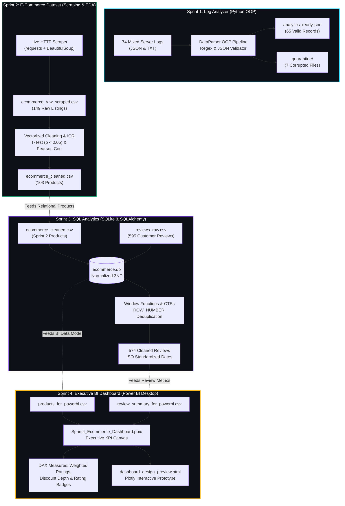

<div align="center">

<!-- Animated Typing Header -->
<a href="https://git.io/typing-svg"></a>

<br/>

<!-- Animated Wave Banner -->


<br/>

<!-- Badges Row 1: Repository Status -->


<br/>

<!-- Badges Row 2: Core Data Technologies -->


<br/>

<!-- Badges Row 3: Developer & Teaching Tooling -->


<br/><br/>

<!-- Profile Views Counter -->


</div>

---


## About This Repository

> *A complete, live-coding project curriculum engineered for Data Science & Engineering cohorts — spanning server log telemetry parsing, live web scraping with EDA, relational SQL modeling, and interactive Power BI executive dashboards.*

This repository acts as a **ready-to-teach, live-coding classroom suite**. Rather than abstract theory or toy datasets, every sprint implements a real-world software pipeline solving genuine production data challenges.

### Core Curriculum Highlights
* **Industry Pipeline Continuity**: Output from Sprint 2 cleans raw listings and feeds Sprint 3's relational database, which directly populates Sprint 4's executive dashboard.
* **Bite-Sized Pedagogical Code Cells**: Code is split into focused 3-to-8 line single-action cells ideal for step-by-step in-class live coding.
* **Question-and-Answer Framework**: Every phase starts with an educational inquiry, concept pointers before the code, and structured takeaway notes after execution.
* **Centralized Datasets Hub**: All benchmark inputs and raw data files are preserved in a dedicated `datasets/` root folder for instant download and demonstration resets.
* **Native Power BI Solution**: Includes an end-to-end `.pbix` solution file alongside Python Plotly interactive dashboard mirrors and complete DAX measure formulas.

---


## End-to-End Curriculum Pipeline



---


## Curriculum Sprint Suite

| Sprint | Domain & Focus | Real-World Challenge | Technologies | Key Artifacts |
| :--- | :--- | :--- | :--- | :--- |
| **[Sprint 1](Sprint1_Log_Analyzer/)** | **Log Analyzer** | Ingest 74 chaotic server logs across mixed formats (JSON, TXT, legacy backups). Validate schemas and isolate corrupted records. | Python OOP, JSON, Regex, Pathlib | [`Sprint1_Solution.ipynb`](Sprint1_Log_Analyzer/Sprint1_Solution.ipynb)<br/>`analytics_ready.json` (65 rows)<br/>`quarantine/` (7 files) |
| **[Sprint 2](Sprint2_Ecommerce_Dataset/)** | **E-Commerce Scraper & EDA** | Scrape live multi-page catalog with rate limiting. Clean dirty price strings, handle missing data, test price differentials ($p < 0.05$). | BeautifulSoup4, Requests, Pandas, Scipy, Seaborn | [`Sprint2_Solution.ipynb`](Sprint2_Ecommerce_Dataset/Sprint2_Solution.ipynb)<br/>`ecommerce_cleaned.csv` (103 rows)<br/>`eda_summary.png` (3-panel) |
| **[Sprint 3](Sprint3_SQL_Analysis/)** | **SQL Relational Engine** | Design 3NF relational schema. Deduplicate 595 reviews via `ROW_NUMBER() OVER`, rank products by category, and parse ISO dates. | SQLite3, SQLAlchemy, SQL Window Functions, CTEs | [`Sprint3_Solution.ipynb`](Sprint3_SQL_Analysis/Sprint3_Solution.ipynb)<br/>`ecommerce.db`<br/>Clean `reviews` (574 rows) |
| **[Sprint 4](Sprint4_PowerBI_Dashboard/)** | **Executive BI Dashboard** | Build business KPI canvas with DAX formulas (weighted average rating, discount impact). Deploy native Power BI desktop solution. | Power BI Desktop, DAX, Plotly, HTML5 Canvas | [`Sprint4_Ecommerce_Dashboard.pbix`](Sprint4_PowerBI_Dashboard/Sprint4_Ecommerce_Dashboard.pbix)<br/>[`Sprint4_Solution.ipynb`](Sprint4_PowerBI_Dashboard/Sprint4_Solution.ipynb)<br/>`DAX_Measures_Reference.md` |

---


## Centralized Datasets Hub

All raw input data and intermediate benchmark files are centralized in [`datasets/`](datasets/README.md). Students and instructors can reset any sprint without touching the solutions.

```
datasets/
|-- README.md                              # Data dictionary & quick copy commands
|-- Sprint_1_Log_Analyzer/
|   `-- daily_logs/                        # 74 raw server logs (JSON, TXT, invalid)
|-- Sprint_2_Ecommerce_Dataset/
|   `-- ecommerce_raw_scraped.csv          # 149 raw scraped listings with currency signs
|-- Sprint_3_SQL_Analysis/
|   |-- ecommerce_cleaned.csv              # 103 cleaned products from Sprint 2
|   `-- reviews_raw.csv                    # 595 raw customer reviews (contains duplicates)
`-- Sprint_4_PowerBI_Dashboard/
    |-- products_for_powerbi.csv           # Denormalized product master
    |-- review_summary_for_powerbi.csv     # Product review aggregates
    `-- ecommerce.db                       # Direct SQLite reporting database
```

---


## Repository File Structure

```
Data_Science_Notes/
|-- Complete Data Science - Project Based Learning.md  # Complete project specification
|-- README.md                                          # Master repository documentation
|-- .gitignore                                         # Git ignore specifications
|
|-- datasets/                                          # Central benchmark data hub
|   |-- README.md                                      # Data dictionary & setup guide
|   |-- Sprint_1_Log_Analyzer/                         # Raw server logs
|   |-- Sprint_2_Ecommerce_Dataset/                    # Raw scraped listings
|   |-- Sprint_3_SQL_Analysis/                         # Clean products & raw reviews
|   `-- Sprint_4_PowerBI_Dashboard/                    # BI reporting tables & database
|
|-- Sprint1_Log_Analyzer/                              # SPRINT 1: OOP File System Engine
|   |-- README.md                                      # Data placement & execution guide
|   |-- Sprint1_Solution.ipynb                         # Step-by-step Q&A solution notebook
|   |-- analytics_ready.json                           # Output (65 valid parsed records)
|   `-- data/                                          # Working data directory
|
|-- Sprint2_Ecommerce_Dataset/                         # SPRINT 2: Web Scraping & EDA
|   |-- README.md                                      # Data placement & execution guide
|   |-- Sprint2_Solution.ipynb                         # Step-by-step Q&A solution notebook
|   |-- eda_summary.png                                # 3-panel statistical EDA export
|   `-- data/                                          # Working data directory
|
|-- Sprint3_SQL_Analysis/                              # SPRINT 3: SQL Relational Database
|   |-- README.md                                      # Data placement & execution guide
|   |-- Sprint3_Solution.ipynb                         # Step-by-step Q&A solution notebook
|   |-- ecommerce.db                                   # SQLite normalized database
|   `-- data/                                          # Working data directory
|
`-- Sprint4_PowerBI_Dashboard/                         # SPRINT 4: Power BI & Executive Dashboard
    |-- README.md                                      # Data placement & execution guide
    |-- Sprint4_Ecommerce_Dashboard.pbix               # Native Power BI Desktop file
    |-- Sprint4_Solution.ipynb                         # Interactive Plotly notebook prototype
    |-- DAX_Measures_Reference.md                      # Complete DAX formula reference
    |-- dashboard_design_preview.html                  # Standalone interactive browser preview
    `-- data/                                          # Working data directory
```

---


## Quick Start & Environment Setup

### 1. Clone the Repository
```bash
git clone https://github.com/JayanGupta/Data_Science_Notes.git
cd Data_Science_Notes
```

### 2. Install Required Python Dependencies
```bash
pip install pandas numpy scipy matplotlib seaborn requests beautifulsoup4 sqlalchemy plotly nbconvert
```

### 3. Launch Jupyter Lab / Notebook
```bash
jupyter lab
```

Navigate to any sprint folder (e.g., `Sprint1_Log_Analyzer/Sprint1_Solution.ipynb`) and execute sequentially.

---


## Contributing

Contributions, enhancements, and suggestions are welcome:

1. Fork the Project
2. Create your Feature Branch (`git checkout -b feature/NewSprintFeature`)
3. Commit your Changes (`git commit -m "feat: enhance sprint analysis"`)
4. Push to the Branch (`git push origin feature/NewSprintFeature`)
5. Open a Pull Request

---


## Show Your Support

Give a star if this repository helped your learning journey or classroom instruction.

<div align="center">

[](https://star-history.com/#JayanGupta/Data_Science_Notes&Date)

</div>

---

<div align="center">

<!-- Animated Footer Wave -->


<br/>

<b>Engineered for Data Science Education by <a href="https://github.com/JayanGupta">Jayan Gupta</a></b>

<br/><br/>


</div>
